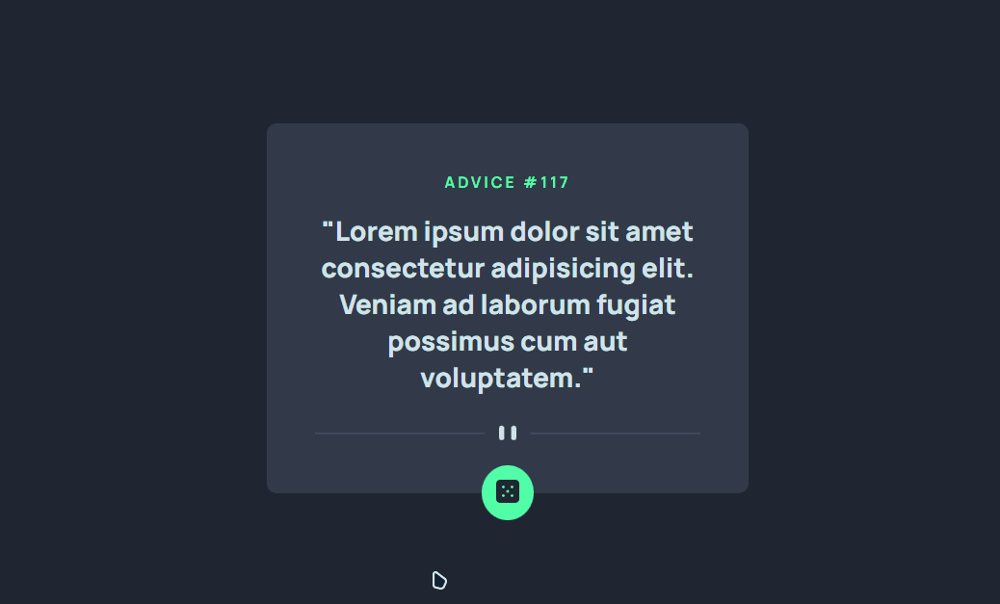
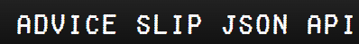

# Frontend Mentor - Advice generator app

### Preview website



### Layout Desktop


### Layout Mobile


Layout Responsivo para Desktop | Laptop | Tablet | Mobile

## Índice

- [Instalação](#instalação)
- [Autor](#autor)
- [Tecnologias](#tecnologias)
- [Referências](#referências)
- [Agradecimentos](#agradecimentos)

## Instalação

Instruções para instalar e configurar o projeto.

```sh
# Clone o repositório
git clone https://github.com/yLucino/DevQuest-Projeto-Advice-generation-HTML-CSS-JS-API.git

# Navegue até o diretório do projeto
cd repo

# Instale as dependências
npm install
```

## Autor

Luciano Chiodini - yLucino
<div> 
  <a href
="https://www.instagram.com/luci_ano_chi/" target="_blank"></a>
  <a href = "mailto:chiodiniluciano@gmail.com"></a>
  <a href="https://www.linkedin.com/in/luciano-chiodini-6a35092b3/" target="_blank"></a>
</div>

## Tecnologias

<div style="display: inline_block"><br>
  
  
  
</div>

## Referências

<a href="https://api.adviceslip.com">Advice Slip JSON API</a>
<br>
</img>

## Agradecimentos

Obrigado por visitar meu repositório! 🙂🫡